## test-lab?
A formal procedure aimed at the discovery of new flaws, risks and vulnerabilities. When it comes to pentesting, its actor simulates an attack against a Network, Application, or System, in order to find and exploit the said vulnerabilities. However, it's important to keep in mind that an impenetrable Network/Application/System doesn't exist, but a systems admin will try their best to make it more difficult for bad actors to break through your fences.

## How often should a test be implemented?
a new pentesting assessment should ideally be performed every time a company adds:
- New network infrastructure
- New application launches
- New offices (especially in new locations)
- New major patches or updates

can find more detailed information on [pentest-standard.org](http://www.pentest-standard.org) and other sources

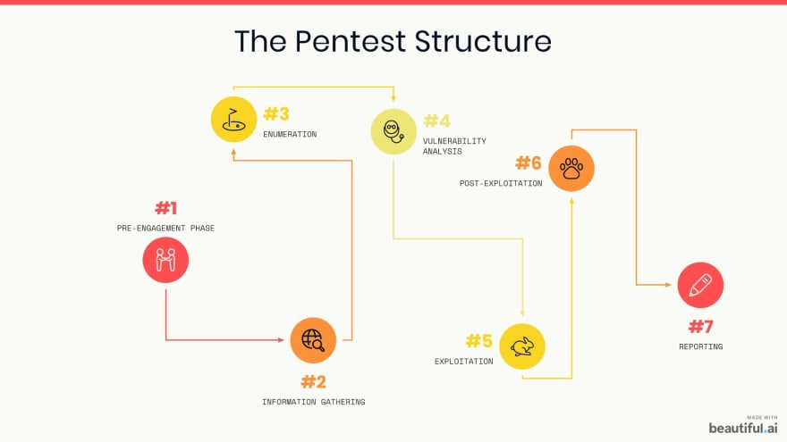

## 1 - Pre-Engagement Phase
The pre-engagement phase represents the first contact between the client and the pentester with an objective to define the scope of the penetration test, as well to explain to client predefine a time estimative for the whole assessment.

In this example, we are going to test our methodology using a virtual machine. Considering our pre-engagement discussions, our **scope** would be the machine's IP: 10.10.148.123 and the **time estimative** would be the box's expiration time, 1h (52m 14s here in the screenshot).

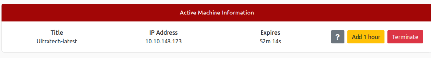

## 2 - Information Gathering
During this phase the pentester will collect intell on the target defined in the scope, in order to understand the target and formulate a strategy for their attack vector. The more information you are able to gather during this phase, the more vectors of attack you may be able to use in the future.

In our case, let's start figuring out how many open ports there are in our target. To do so, we can run rustscan via a docker container using:

`docker run -it --rm --name rustscan rustscan/rustscan -a 10.10.148.123`

Let me explain this command to you:
- **docker run -it —rm —name** - activates the docker container I am using rustscan from.
- **rustscan** - Rustscan is a powerful and superfast network scan tool, way better and faster than the traditional and well-known Nmap when used to identify open ports. When running a professional pentest (that will probably have a few days or weeks as time estimative) you can run rustscan multiple times and also an Nmap or other tools (like hand-crafted Python scripts) to be really sure which ports are open.
- **/rustscan** - Rustscan's version, defining which container will be selected and utilized (in this case, since there are no special version predefined, it's running the latest).
- **10.10.148.123** - Our target IP.

Since Rustscan is not packed natively inside Kali Linux, you might find useful information on how to install it in the official documentation [https://hub.docker.com/r/rustscan/rustscan](https://hub.docker.com/r/rustscan/rustscan)

If you want to run nmap as well for an all-ports scanning, you can run:

`nmap -sC -sV -p- 10.10.180.145`

- **nmap** - Activates nmap
- **-sC** - Will run nmap's script reconnaissance, identifying which scripts might be useful against each of your findings.
- **-sV** - Will determine which service version is running on each of the open ports.
- **-p-** - Will run the nmap against all 65,535 ports available for communication. This is why it takes so long to be done, but when it's done you'll have proper information on all the available ports, instead of the standard top most common ports outcome you'll get running a simple **-p**.

The outcome from Rustscan will return:

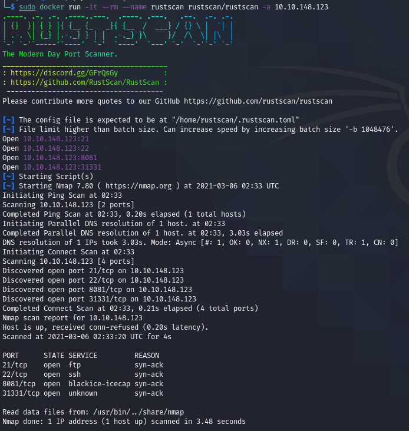

So now we know we have ports **21, 22, 8081** and **31331** open. In my methodology, after running Rustscan, I like to run a complete Nmap focused on the open ports, which will return detailed information on the ports that I already know that are open.

`nmap -T4 -A -Pn -v -p 21,22,8081,31331 10.10.148.123`

- **nmap** - Activates nmap
- **-T4** - Defines how fast nmap will perform the scan. The speed varies between T1 and T5, the latter being the fastest as well. However, it's important to note that it's also a very "noisy" approach, probably being easily detected by a mildly secure target. Normally it's not ideal to use such a fast speed in a real-world target, but it can be also a good tactic to try to run the same nmap scan with different speeds, in order to have a better understanding on the target's defenses, and what it can really identify.
- **-A** - Enables OS detection, version detection, script scanning, and traceroute.
- **-Pn** - Treats all hosts as online -- skip host discovery.
- **-v** Increases verbosity level, returning more detailed information on each step of the scan
- **-p** - Defines which ports will be scanned. If it's not specified, it will run against the top 1000 most common ports. In this case, we are specifing the ports with the findings we got in the previous step.
- **21,22,8081,31331** - The ports we found out with Rustscan.
- **10.10.148.123** - Our target's IP.

The core information outcome from the nmap scan is detailed in the screenshot below.

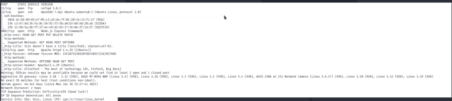

## 3 - Enumeration
One can argue that Information Gathering and Enumeration are the same steps. I would add that the process of gathering information can be extensive and even include the Phase 4 - Vulnerability Analysis in the process. No matter how you call those phases, one thing should be learned before all of this: Gather as much information as possible. Enumerate every port you find, analyze and model your threats as much as you can. This will make your life easier in the following steps, and this will also provide a lot of useful and valuable information to your client: At the end of the day, it's your job to inform them as much as you can, so the more you get out of this big _Discovery Phase,_ the better.

Now that any naming issues have been disclaimed, let's move on with our analysis. We know the open ports already, so let's start exploring them. In my personal methodology, I like to address any HTTP Ports to see if they have a functional website from where I can extract more information. So let's start with our target's IP + 8081 (the first open HTTP Port from our scan).

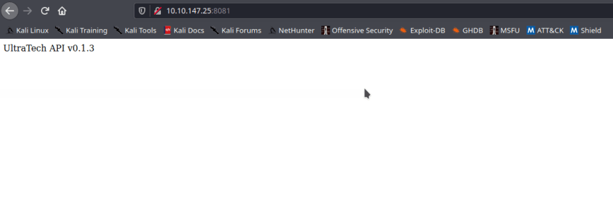

As you can see, this particular website looks like it's just a work-in-progress. Let's keep this as a note, and try the other open HTTP Port, 31331

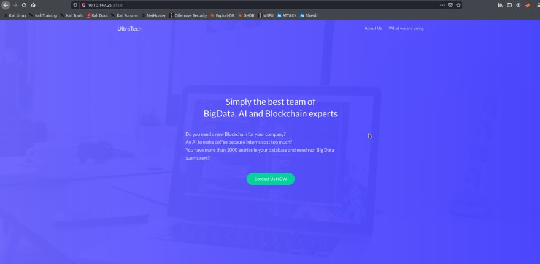

Now we have something cool here! This looks like a more complete, production-ready website. As a pentester, it's our job to explore every corner of this website looking for potential input areas, hidden information and every sorts of alluring things we can add to our report. In my case, I like to explore hidden directories first, since there are a lot more than meets the eye when it comes to web applications. Common practices such as running **GoBuster** or **DirBuster** can be really useful, but I like to start simple before running my big, brute-forcing guns. The more you explore web applications, the more you'll notice a pattern when it comes to hidden directories, and then you can also start writing your own personal list of directories you can start checking out for. In my case, considering how important it is for applications nowadays to have a good SEO policy in their websites, I like to start from a very common **robots.txt** file.

But first, what is a **robots.txt** file? To make it short, when Google bots are scrapping your website after keywords to enhance your SEO strategy and put it in the front page in every google search, they will look for what they need in every directory. However, you can indicate to them which directories they should **NOT** look for any keyword, and the way you indicate it to them is by configuring these directories in the **robots.txt** file. The reasons may vary, but usually the directories found in this file are really important for administrative work in the website, and they are also hidden from the public eye, which means that some really good intel can be found there. Some other files and folders that can bring you good information are **admin, login and upload** pages. But let's start with :31331/robots.txt to see what we can get.

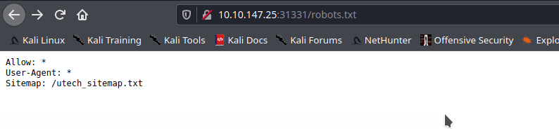

Nice! We got some cool information about the site map, so let's go after it now.

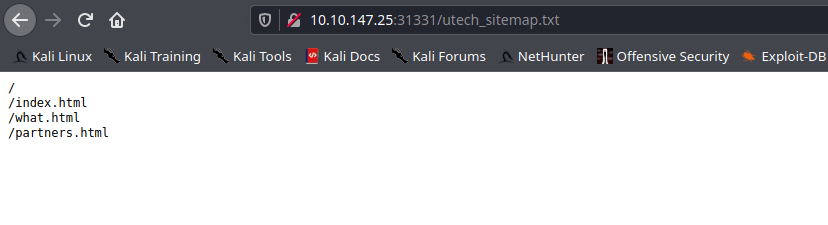

A lot more information for us! Now we know about 2 pages we can explore (index.html is just the landing page), and we didn't even had to run a brute-forcing tool for that!

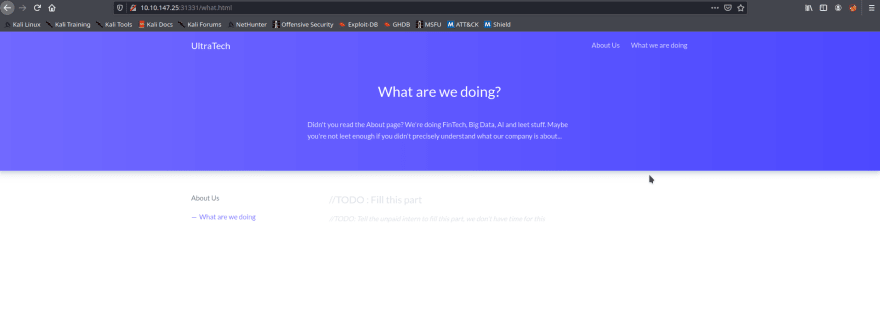

Looking for the **what.html** page, we can notice that it's just a work in progress page. We can look for any hidden in the source code, but apparently there are nothing outstanding hanging there.

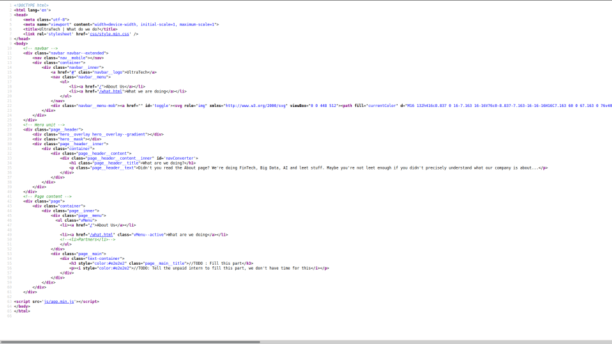

When we go after that **partners.html** page, however, there is a login form there, just chilling. Login forms are amazing doors to the inner workings of a company, and exploiting them can be a really damaging.

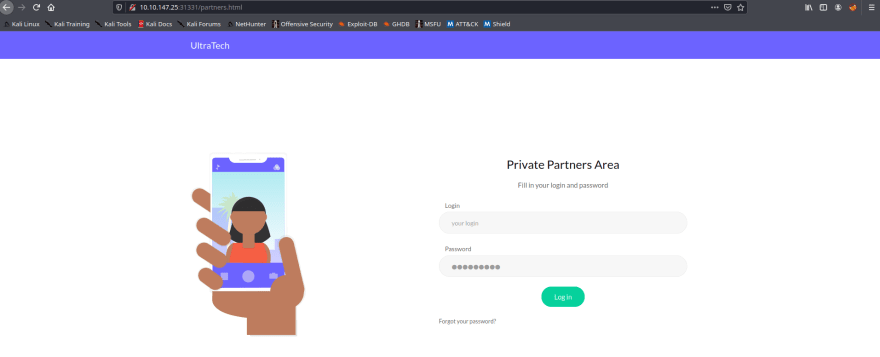

Now, if we look in the source code, we are able to see some intriguing findings.

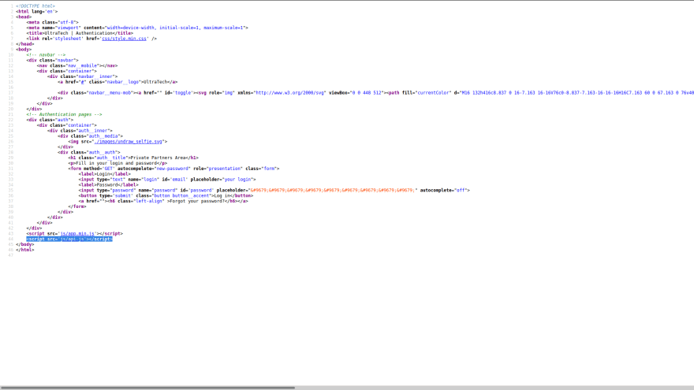

Here we have a link to an **api.js** script, and after clicking on it, we are able to find the script's code.

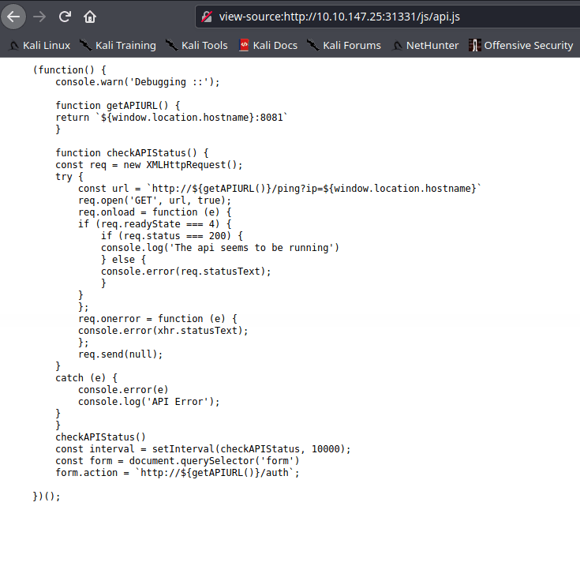

There is a really cool line of code here, and this is the following:

`const url =`http://${getAPIURL()}/ping?ip=${window.location.hostname}``

According to the code, it will try to ping the API to check if it's working. We can look for more information on this, by tweaking the parameters a bit and running it on our browser. Let's first it try with:

`http://10.10.147.25:31331/ping?ip=10.9.208.115`

Let me explain what I changed here. I switched the `**${getAPIURL()}**` field to our target's IP + the HTTP Port we are at right now. And I changed the `**${window.location.hostname}**` parameter to our machine's IP, in order to test if it can ping back our machine.

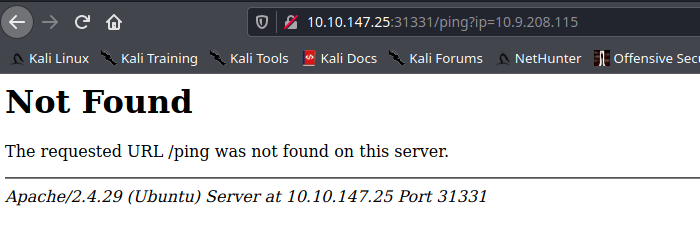

Hmmmm, apparently it didn't work as expected. However, if you remember, there are another HTTP Port open in this application, the 8081. Let's try with this one now by running

`http://10.10.147.25:8081/ping?ip=10.9.208.115`

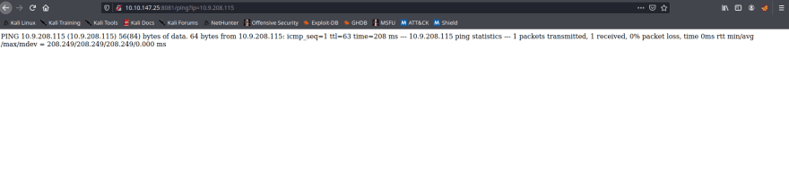

Okay, this is way better! The output confirms that we can actually run and see terminal commands in our web browser! Now let's run a **ls**, the Linux command to list all the files in a given directory, with:

`http://10.10.147.25:8081/ping?ip=`ls``

It's a similar command from what we've used before, but now with a `ls` at the end instead of our machine's IP parameter.

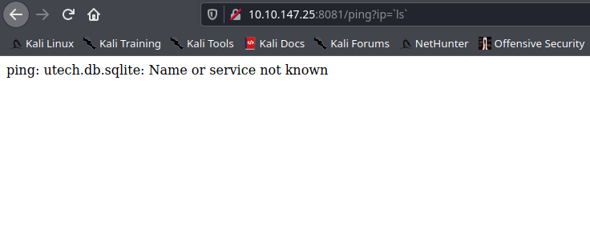

Now we have some more information about a database related to our target application, that can be really useful for us.

So let's start exploring this database by running a `cat` on it. The whole command would be `cat utech.db.sqlite`, so we need to write `http://10.10.147.25:8081/ping?ip=`cat utech.db.sqlite`` in our browser, which returns:

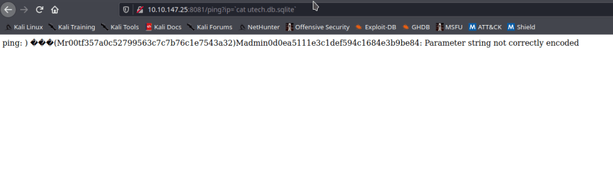

Awesome! Now we have some (hashed) credentials that we can use. I mean, as soon as we decode them. So let's start creating some new files to store them in our machine.

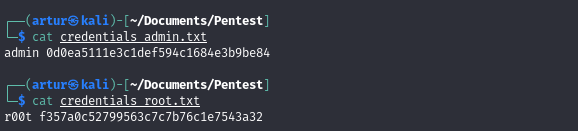

To crack the hashes, first we gotta know which hashing algorithms were used to hash them in the first place. We can run `hash-identifier f357a0c52799563c7c7b76c1e7543a32` in order to retrieve information about it.

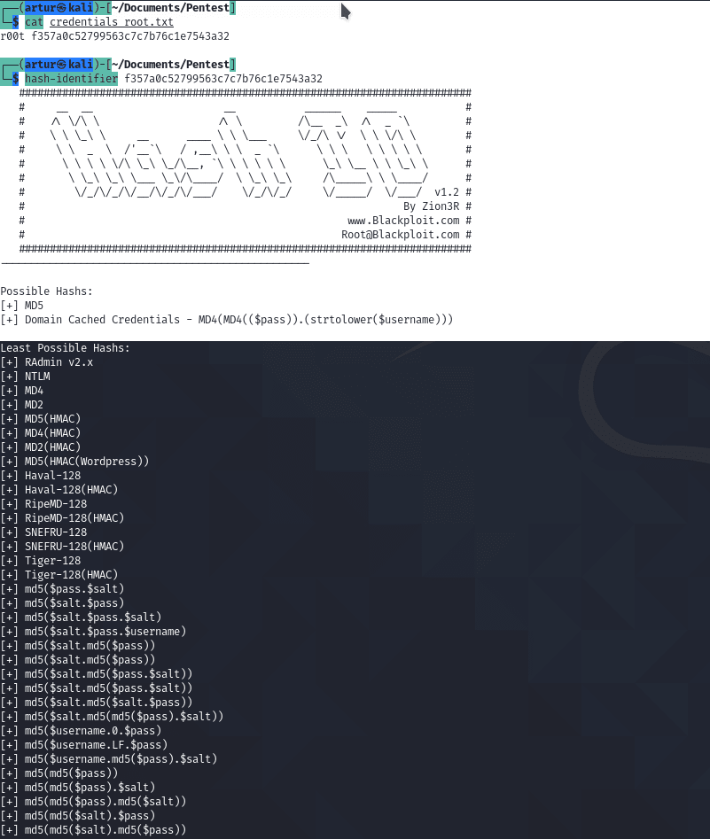

**hash-identifier** has disclosed that it's possibly a MD5 hash that we are dealing with.

To look for a reverse lookup (since hashes are impossible to crack) we can go to [https://md5hashing.net/hash](https://md5hashing.net/hash). This website is linked to a database of hashes and their original values, and it compares whatever string it gets as input with values stored in the database in order to "decrypt" them.

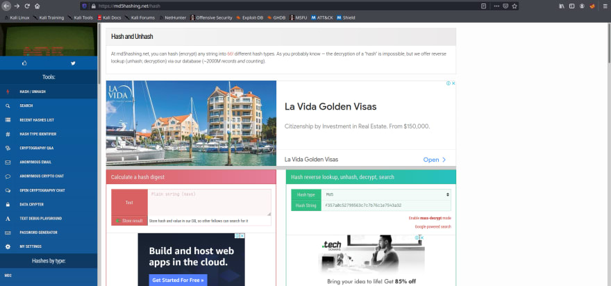

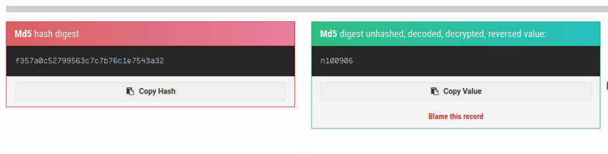

Nice, so now we have full credentials for one of the users! **r00t:n100906** is something we can use later, for sure. Now, let's repeat the same steps with the other user.

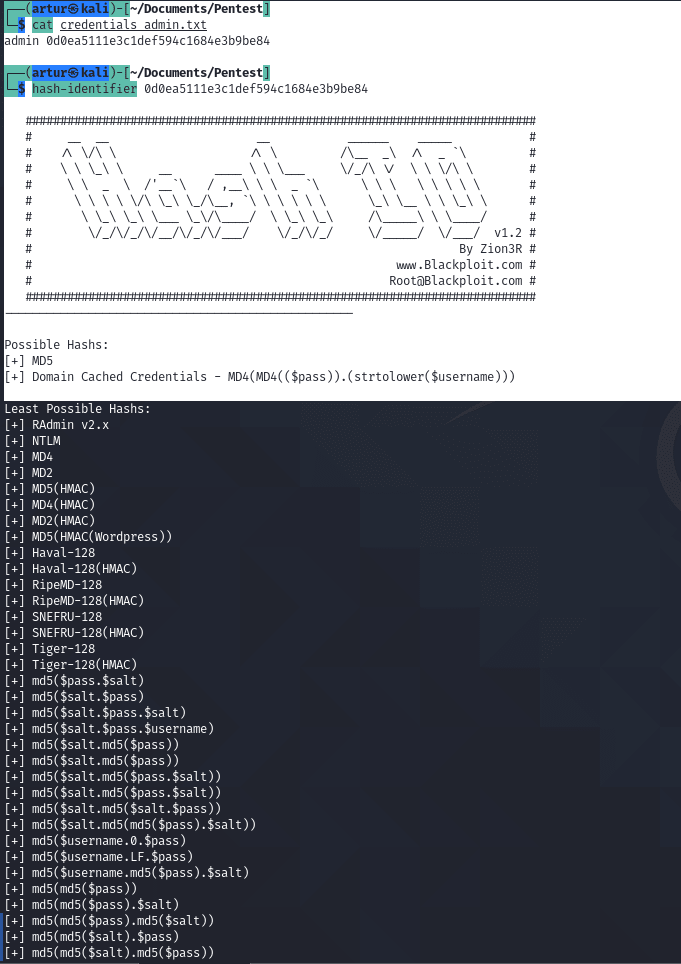

And then, finally:

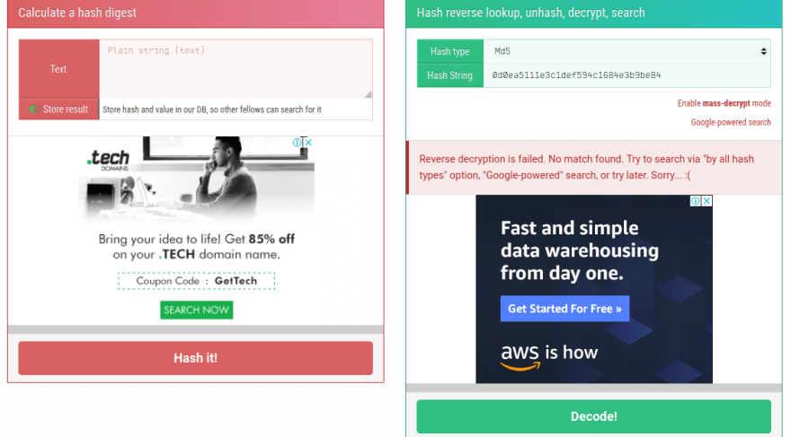

However, now we didn't get a decrypted value from this. Which is okay, not all values can be stored in the decryption database, and sometimes - even if you have a specified wordlist with all the possible values for a credential - you won't get a result from it. That's a good point for the company (even though leaving hashes accessible to malicious actors is a massive negative point), so for brevity reasons we can move on to the next phase.

## 4 - Vulnerability Analysis
In this phase the pentester will leverage the systems and applications and their correspondent vulnerabilities. They will analyze the scope for each attack vector found out until this moment, and they will consider the best way to exploit them. In our case, we know that our target runs a FTP on port 21 and a SSH on port 22. It also runs some websites and, most importantly, even a login page. You can abuse your Google-Fu skills, and also get any information available and use [https://www.exploit-db.com/](https://www.exploit-db.com/) or `searchsploit` on the command line. In my personal taste I like to try low-hanging fruits first, or simply the obvious stuff. It's pretty common to overengineer your attack and try some extreme techniques, but sometimes you just need to keep it simple to attest that your target system isn't that secure.

That being said, we stand here with a lot of useful information about our target system already, including some credentials and three possible places where we can use them to move on to the Exploitation Phase: FTP, SSH and the login page. With that in mind, let's do as I said and try those.

## 5 - Exploitation Phase
The Exploitation phase is the moment where you gather all the information acquired in the previous phases, and apply them with the sole objective of bypassing the target system's defenses and establish access to it. As I mentioned before, if the Vulnerability Analysis Phase was carefully planned, this current phase should be a precise attack. With our plan to use the credentials in mind, let's go and execute it.

By going to the :31331/partners.html, which is a login page, we use the credentials we found during the Enumeration phase, but it leads to a dead end.

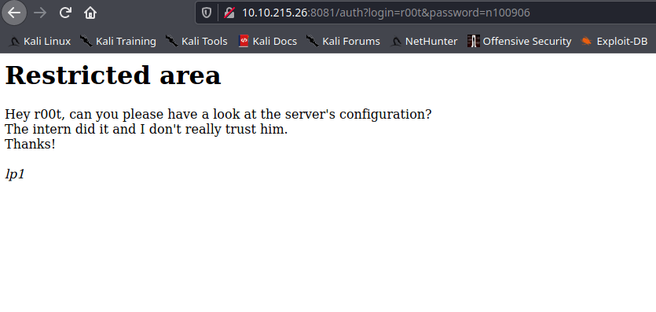

That's okay. We keep this as a note, and move on to our second vector, the SSH on port 22. By using the credentials there, we can get into the system!

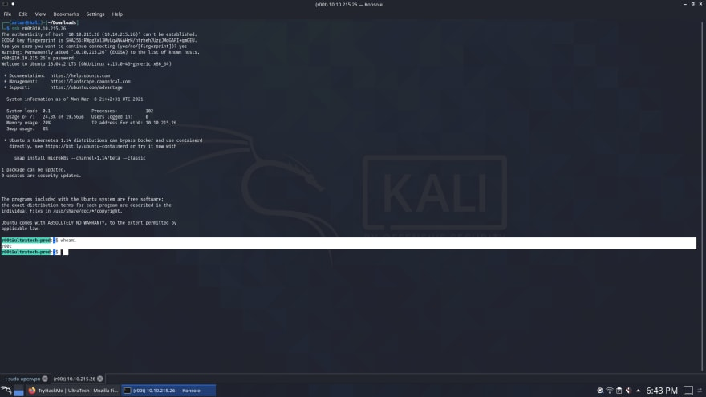

Those credentials can also be used to log into the FTP service, as showed in the screenshot below.

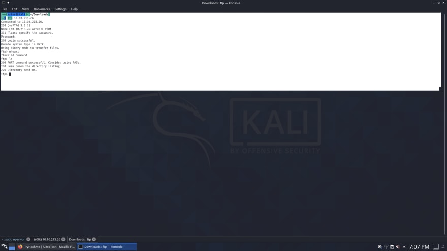

Okay, now that we have access in multiple fronts, we can say that we performed a successful Exploitation Phase.

## 6 - Post-Exploitation Phase

This phase is the proof that a well-executed penetration test won't finish once the pentester obtained access to the machine. Now it's time to move on and try to (if previously agreed on the pre-engagement phase, of course) 1) Observe which sensitive files that can be accessed by a possible attacker 2) Try to escalate privileges 3) Cause denial of service 4) Maintain and persist access for later exploitation.

We can start looking around for critical files, but a good way a CTF-based box such as the ones we can find on TryHackMe and HackTheBox emulates these files is by using flags. One has to keep in mind that flags alone are not what you will see on a real-world scenario. That being said, let's try to look for the root user SSH private key, as specified by the [original box exercise](https://tryhackme.com/room/ultratech1).

To check which programs can be accessed by the super user on Linux, I like to run `sudo -l`. This can be a good way to enumerate attacking vectors for you to escalate your privileges to the root user. However, in this specific case, this didn't work.

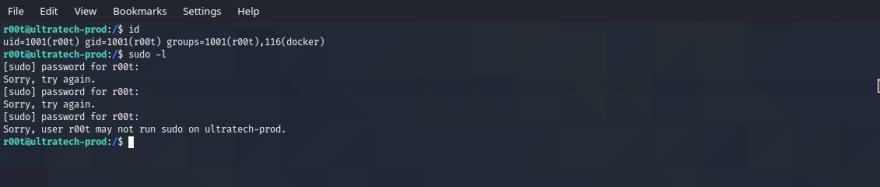

As we can see in the screenshot above, the r00t user (just a regular user, not the actual root user) is part of a docker group, which can be a way to escalate privileges. We can check this out and confirm our theory by running LinEnum, that we can find on [https://raw.githubusercontent.com/rebootuser/LinEnum/master/LinEnum.sh](https://raw.githubusercontent.com/rebootuser/LinEnum/master/LinEnum.sh). Once we access it, we just need to copy the raw code, move back to the r00t base directory, create a **[linenum.sh](http://linenum.sh)** file (using **nano** or **vim**, for example) and paste it there, save the file and make it executable by running `chmod +x linenum.sh` ****

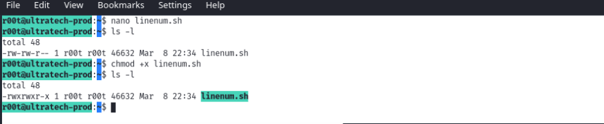

We can now run `./linenum.sh > lin` to run the script and save the information in a newly created **lin** file. It might take a while, but once it's done we just need to open that file to get the following outcome:

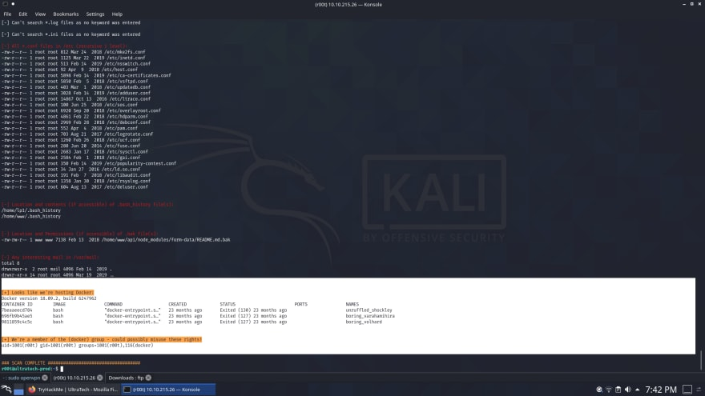

As the script mentioned there, looks like we're hosting Docker, and we could possibly misuse this group's permissions.

An awesome resource for privilage escalation is the GTFOBins, and it has a specific section just for docker exploitation, as we can find here - [https://gtfobins.github.io/gtfobins/docker/#sudo](https://gtfobins.github.io/gtfobins/docker/#sudo)

This one specifically explains how we can move to sudo by misusing Docker permissions, and we just need to run a simple command:

`sudo docker run -v /:/mnt --rm -it alpine chroot /mnt sh`

However, this command will try to get a vanilla docker box - alpine - and in our case it won't work properly. With a simple tweak, however, we can change this. We just need to switch from alpine to **bash** and remove the sudo command, since we're not currently running as sudo*_:_*

`docker run -v /:/mnt --rm -it bash chroot /mnt sh`

After a short wait, the exploit concludes and we have sucessfully escalated our privileges

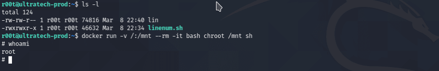

Now that we are running out the highest of the privileges, we can start looking for useful information - as it's mentioned as the main objective of the post-exploitation phase.

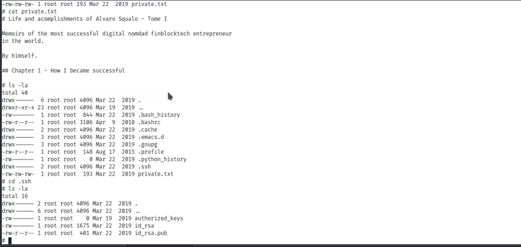

Here we can find some critical, sensitive information, such as this **private.txt** file and the **SSH keys**. This is an awesome finding, and for the context and scope of this box, it also concludes our post-exploitation phase.

## 7 - Reporting Phase

This is the point where you are going to conclude all processes, findings, attacking vectors and analysis from your whole penetration test assessment, in a clear, objective language that will make it easy to understand for the stakeholders that will use it to lead their decision-making process in the company. This is arguably the second most important Phase in the whole process, sometimes even more important than the Information Gathering Phase, because if it's not clear, the whole assessment won't be useful at all to the company.

There are a lot of models and layouts for you to create your own reports, but the most important aspect of it is the need to be understood. Details are also important here, and a good guideline can be found at [http://www.pentest-standard.org/index.php/Reporting](http://www.pentest-standard.org/index.php/Reporting)

## Conclusion

This concludes this post, which was written with the intention to kickstart people into Pentesting and Cybersecurity. However, this isn't a final read, just a suggestion on how you can start developing your own methodology. I recommend you start researching on other people's methodologies, as well as practice a lot of techniques on CTFs and even bug bounties. This will get the gears spinning and making things easier to understand in the long run.

And keep in mind that Cybersecurity is an ever-evolving field, so never stop learning. Try new stuff everyday, read a lot, get new perspectives on subjects you _thought_ you had mastered, and stay humble!

ref: https://dev.to/arturserra/getting-started-with-penetration-testing-and-building-your-own-pentest-methodology-498a

