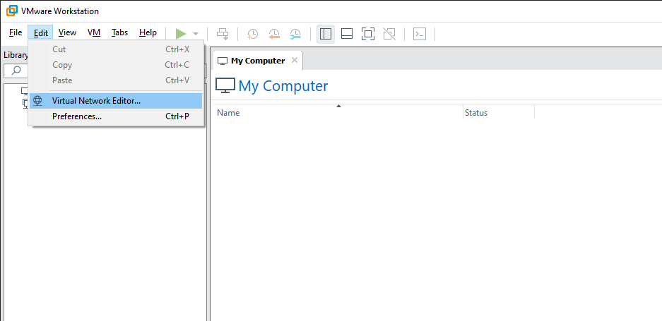

(https://www.whiteoaksecurity.com/blog/building-a-test-lab-for-pentesting/)

## Setting Virtual Networking
first need to check out the virtual network settings that the  hypervisor configures out of the box. By default, VMware creates two special networks: 
- VMnet1 (host-only) 
- VMnet8 (NAT). 

On both of these networks, your hypervisor will install a virtual adapter on your native host and a virtual DHCP server that will allocate addresses to any VMs that are attached to the networks. We don’t necessarily want to use this, as we’ll be setting up DHCP and Domain services manually, so we will need to set up a custom host-only virtual network without the attached host adapter and DHCP server. Below is an example of what it looks like. Note that both the “Connect a host virtual adapter…” and “Use local DHCP service…” checkboxes are disabled.
]


![[2 network-editor.png]]


## Building VMs
For this test lab, we’ll setup the following VMs:

- CentOS 7 – Virtual Router
    - Configured with 2 interfaces, acting as the gateway for VMnet10
    - VMnet8 – used to connect to the internet via a native host (NAT)
    - VMnet10 –172.16.100.1 (must be static)
    - Running DHCP service for VMnet10 network 172.16.100.0/24
- Windows Server 2016 – Domain Controller VM
    - VMnet10 interface: 172.16.100.10 (must be static)
- Windows 10 – Workstation VM
    - VMnet10 interface: dynamically-assigned IPv4 address
- Kali Linux – Attacker VM
    - VMnet10 interface: dynamically-assigned IPv4 address

Here is a small diagram of what it will look like once it is setup:
![[2 setup.png]]


The only settings that will need to be specifically set are the Network Adapters. For each VM, go to the Settings screen and select the Network Adapter to assign them to the custom VMnet10 that we set-up earlier. For the CentOS 7 Router, add a second adapter and configure it for NAT (VMnet8). This is where all network traffic on the test lab will be routed through.


## Configure Virtual Machines

At this point, we’ll need to configure networking on the virtual machines. For the CentOS Router, we’ll also set up DHCP and configure it with a basic NAT/IP masquerade setup.

## Configure Virtual Router

Below is a breakdown of the commands required to set up the Linux machine as a virtual router. Note that these commands should be run using the root user account.

In order to identify which interface is associated with the external (NAT) interface, you’ll need to compare the settings for the VM and within the CentOS virtual machine.

![[2 conf-vrouter.png]]

Identify which interface is “external” for the test lab based on the MAC address. On this one, ens34 is the external NAT network and ens33 is associated with the internal VMnet10 network.

```
nmcli device show
```

![[2 nmcli d show.png]]

Set ***external*** interface using command line (dynamic):

```
nmcli connection add con-name ext0 ifname ens34 type ethernet autoconnect yes
nmcli connection modify ext0 ipv4.dns 1.1.1.1
nmcli connection modify ext0 connection.zone external
nmcli connection up ext0
```

Set ***internal*** interface using command line (static):

```
nmcli connection add con-name int0 ifname ens33 type ethernet autoconnect yes ip4 172.16.100.1/24 gw4 172.16.100.1
nmcli connection modify int0 ipv4.method manual ipv4.dns 172.16.100.10 ipv6.method ignore ipv4.never-default yes
nmcli connection modify int0 connection.zone internal
nmcli connection up int0
```

Install and configure DHCP:

```
yum install dhcp -y
```

Add the following lines to the **dhcpd.conf** file:

```
default-lease-time 600;
max-lease-time 7200;
ddns-update-style none;
authoritative;
subnet 172.16.100.0 netmask 255.255.255.0 {
range 172.16.100.128 172.16.100.254;
option routers 172.16.100.1;
option subnet-mask 255.255.255.0;
option domain-name-servers 172.16.100.10;
}
```

Run and enable DHCP server:

```
systemctl enable dhcpd
systemctl start dhcpd
```

Configure routing and NAT for ***internal*** virtual network:

```
echo "net.ipv4.ip_forward=1" >> /etc/sysctl.conf
sysctl -w net.ipv4.ip_forward=1
firewall-cmd --permanent --direct --passthrough ipv4 -t nat -I POSTROUTING -o ens34 -j MASQUERADE -s 172.16.100.0/24
```

Modify default firewall zones:

```
firewall-cmd --change-interface=ens34 --zone=external --permanent
firewall-cmd --set-default-zone=internal
firewall-cmd --complete-reload
```

Install open-vm-tools (optional):

```
yum install open-vm-tools -y
```


At this point, basic networking should be available on the network, including DHCP which will provide clients with dynamic IP addresses and connectivity options. Although we set up DHCP to provide clients with a DNS server on the network, we have not yet configured DNS, which will be provided by the domain controller.


## Configure Domain Controller
For the test lab, we’ll configure the Windows 2016 server with a basic Active Directory set-up. First, you’ll need to configure a static IP address and networking information. You also will want to change the hostname to something more indicative of a domain controller, such as “dc01”. For all commands, you’ll need to open a PowerShell window as an administrator.

Determine interface index for Ethernet0 adapter:

```
Get-NetIPAddress -AddressFamily IPv4
```

![[2 Get-NetIPAddress.png]]

Configure networking via PowerShell command line for interface index 5:

```
New-NetIPAddress -InterfaceIndex 5 -IPAddress 172.16.100.10 -PrefixLength 24 -DefaultGateway 172.16.100.1
Set-DnsClientServerAddress -InterfaceIndex 3 -ServerAddresses (“127.0.0.1”,”1.1.1.1”)
Rename-Computer -NewName “dc01” -Restart
```

Set local administrator account password (this account will become the domain admin account upon installation of domain services):

```
Get-LocalUser -Name Administrator | Set-LocalUser -Password (Read-Host -AsSecureString)
```

*(Enter password interactively)*

Install Active Directory and set up server as Domain Controller (you will need to setup a DSRM password, which is used for booting the DC into safe mode):

```
Install-WindowsFeature -Name AD-Domain-Services -IncludeManagementTools
Install-ADDSForest -DomainName “testlab.local” -InstallDns
```

*(Enter DSRM password interactively)*

![[2 Active Directory install steps.png]]


## Configure Windows 10 Workstation

Once you have your domain controller setup, the final step in setting up the target virtual machines will be to attach the workstation to the domain. Once again, you’ll want to rename the host to something more descriptive, representing a real network setup.

Configure networking via PowerShell command line (will reboot afterwards):

```
Rename-Computer -NewName “workstation01” -Restart
```

Add computer to domain:

```
Add-Computer -DomainName testlab.local -Credential testlab\Administrator -Restart -Force
```


## Next Steps

Once everything is set up, you should be able to log into your Kali attack VM and it will obtain a DHCP lease just as the Windows 10 machine does. From here, you should be able to access the network with everything configured in a baseline state. Out of the box, Windows configurations are fairly secure by default, although in the real world this will change substantially based upon the use case and functionality needed for the domain. Even so, there are many initial steps that can be taken to assess the network. To start, a quick Nmap scan can be used to probe the domain controller, as shown below:

![[2 nmap scan.png]]
